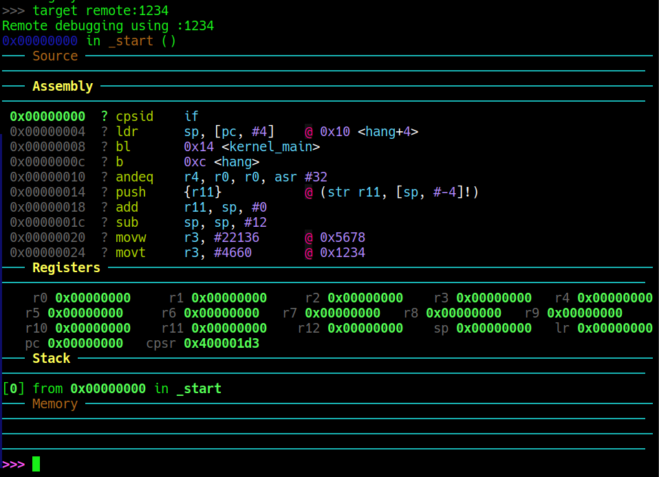

# Trabajo Práctico 0: Boot Bare Metal mínimo
## 1. Objetivo
Se trata de tomar el control del SoC de una Zync 7010, justo a la salida del firmware de inicialización que ejecuta al momento del reset en la **OCM** (On Chip Memory), o **Boot ROM**. Una vez finalizado este firmware de inicialización y Chequeo de integridad del sistema, se asume que en la dirección **0x00000000** de la memoria externa se encuentra la 1er. instrucción del First Stage Boot Loader (**FSBL** de ahora en mas). Este módulo es justamente lo que pretendemos desarrollar.

La tarea es ardua, por lo tanto, lo mas adecuado es desarrollar nuestro humilde **FSBL** de manera incremental con pasos lo mas pequeños posible.

En el caso del TP0, nuestro propósito además es configurar y poner en marcha el ecosistema de desarrollo

## 2. :hammer_and_wrench: Toolchain
Vamos a desarrollar este firmware en una PC con procesadores de arquitectura x86 de intel, y Sistema Operativo Linux (¡obvio!). Por lo tanto necesitamos contar con un crosscompiler. Es decir un compilador que ejecute en un procesador de arquitectura x86, pero que el código que produzca sea ARM32.
Al trabajar bare metal conviene instalar entre todas las opciones de crosscompiler para ARM, el paquete ```binutils-arm-none-eabi```. Para debugear el gdb responde a la arquitectura local del sistema. Es mucho mas práctico, el paquete ```gbd-multiarch```.La emulación se ejecutará en qemu, de modo que vamos a necesitar el  paquete ```qemu-system```.

En una terminal ejecutar:
```bash
sudo apt install binutils-arm-none-eabi \
                 gdb-multiarch \
                 qemu-system \
```
Hay varias interfaces que se pueden montar con **```GDB```**. Yo utilizo cirrus-Dashboard, disponible en https://github.com/cyrus-and/gdb-dashboard. Trabaja en modo texto, de modo que al ejecutar en una consola es muy liviana, y gracias a ncurses es suficientemente intuitiva. Para instalarla se clona el proyecto en nuestra PC.

```bash
git clone https://github.com/cyrus-and/gdb-dashboard.git
```
Lo que descargamos es un archivo denominado ```.gdbinit``` listo para colocar en el **```HOME```** directory de nuestro usuario. El primer impulso es copiarlo, pero es mas práctico crear un archivo ```~./.gdbinit``` que lo referencie. Para ello ejecutaos estos simples comandos:
```bash
cd ~
echo "source ~[path en el que clonamos dashboard]]/gdb-dashboard/.gdbinit" > .gdbinit
```
Con esto aseguramos que en cualquier path dentro del file system, al ejecutar **```GDB```** se ejecuye el script de Python que convierte una interfaz poco amable (como lo es la de **```GDB```** raw)

Por otra parte agregamos en el root de nuestro proyecto un ```.gdbinit``` adicional para manejar los aspectos específicos que surgen de trabajar con ARM.

En el siguiente esquema, se muestra como será la estructura de nuestro proyecto dividido en subdirectorios uno por cada tp. Por ahora solo el tp0 esta definido. Sin dudas a medida que aumentemos la cantidad de código aparecerán otros modulos y fuentes. 
```
microkernel-tps/
 ├── .gdbinit
 ├── tp0/
 │    ├── Makefile
 │    ├── start.S
 │    ├── kernel.c
 │    └── linker.ld
```
El archivo .gdbinit especifica algunas cosas específicas para nuestro proyecto
Su contenido es:
```gdb
set architecture arm
define hookpost-remote
    break _start
end

dashboard -layout source assembly registers stack memory
dashboard assembly -style opcodes
dashboard registers -style list
dashboard stack -limit 8
```
Es decir especificamos la arquitectura que vamos a debugear, y le aseguramos un breackpoint en ```_start```que es la primer instrucción ejecutable del **FSBL**.

Como **```GDB```** lee su configuración en el archivo ```~/.gdbinit``` agregamos en ese archivo la referencia a este de nuestro proyecto:
```bash
echo "source ~[path a nuestro directorio raiz del proyecto]/.gdbinit" >> ~/.gdbinit
```
De tal modo que se agregue una segunda línea al archivo del **```HOME```**, que referencia al ```.gdbinit``` específico del proyecto.
A modo de ejemplo adjunto mi caso particular en mi HOME de acuerdo a como tengo organizado mi disco. 
```gdb
source ~/data/git/gdb-dashboard/.gdbinit
source ~/data/git/Zynq7010-baremetal/.gdbinit
```
## 3. Ejecución
### Build
En una terminal ejecutar simplemente se ejecuta:
```bash
make
```
Se generan los siguientes archivos:
```bash 
                                ┌─ start.lst
start.s  ─── arm-none-eabi-gcc ─┤                    
                                └─ start.o  ─┐          
                                             ├─ arm-none-eabi-ld ─ kernel.elf
kernel.c ─── arm-none-eabi-gcc ─── kernel.o ─┘

kernel.elf ─── arm-none-eabi-objdump ─── kernel.bin 

```
El linker toma los dos objetos reubicables (los terminados en ```.o```) y genera kernel.elf. ëste archivo es el insumo para ```gdb-multiarch```, ya que en éste archivo está toda la información simbólica.  Sin embargo, este archivo no nos sirve para nuestra simulación ya que no hay Sistema Operativo que lea el encabezado **```ELF```**. Por lo tanto necesitamos un binario crudo con el código que ejecutará nuestro sistema. Para truncar el encabezado **```ELF```** a un binario crudo se emplea ```arm-none-eabi-objdump```.

### Para ejecutar tp0
Usar dos terminales:
#### terminal 1: 
```bash
 make debug
```
Este comando ejecuta ```qemu``` cargando el archivo bin a partir de la dirección **0x00000000**.
El resultado parecerá desesperanzador:
```bash
$ make debug
qemu-system-arm \
-M xilinx-zynq-a9 \
-nographic \
-S -s \
-device loader,file=kernel.bin,addr=0x0

```
Esta salida tan poco comunicativa es ni mas ni menos que la que debemos obtener. No es mas que **```QEMU```*** ejecutando el binario.

**```QEMU```** carga el binario en memoria, en la dirección **```0x00000000```**, inicializa la CPU emulada (es decir, emula la tarea de la Flash **OCM**) y abre un socket TCP (**```GDB stub```**); si se usa -S, la CPU queda en pausa hasta que **```GDB```** se conecta y ordena continuar la ejecución. 

>[:heavy_check_mark: : **<span style="color:green">Importante</span>**]
>*Al lanzarlo con la opción -S, **```QEMU```** inicializa la CPU emulada pero la deja detenida antes de ejecutar la primera instrucción, esperando que **```GDB```** se conecte y tome el control.*

Debemos dejar ejecutando **```QEMU```** hasta finalizar el debug. Que como veremos se realiza en otra terminal
Para salir pulsamos **```CTRL```**+```A``` ```x```. 

#### terminal 2: 

```bash
 gdb-multiarch kernel.elf
```
Al debuger le pasamos como argumento el archivo ```.elf``` para que pueda leer los símbolos. Inicia **```GDB```** leyendo los dos ```.gdbinit``` ya mencionados y queda esperando el primer comando:

```bash
$ gdb-multiarch kernel.elf

GNU gdb (Ubuntu 15.1-1ubuntu1~24.04.1) 15.1
Copyright (C) 2024 Free Software Foundation, Inc.
License GPLv3+: GNU GPL version 3 or later <http://gnu.org/licenses/gpl.html>
This is free software: you are free to change and redistribute it.
There is NO WARRANTY, to the extent permitted by law.
Type "show copying" and "show warranty" for details.
This GDB was configured as "x86_64-linux-gnu".
Type "show configuration" for configuration details.
For bug reporting instructions, please see:
<https://www.gnu.org/software/gdb/bugs/>.
Find the GDB manual and other documentation resources online at:
    <http://www.gnu.org/software/gdb/documentation/>.

For help, type "help".
Type "apropos word" to search for commands related to "word"...
The target architecture is set to "arm".
The target architecture is set to "arm".
opcodes = False
list = 'r0 r1 r2 r3 r4 r5 r6 r7 r8 r9 r10 r11 r12 sp lr pc cpsr'
Reading symbols from kernel.elf...
>>> 
```
Lo primero que se debe tipear es el comando para conectarlo con **```QEMU```**:
```bash 
>>> target remote :1234
```
Una vez que ejecutamos este comando el sistema ingresa sin ejecutar nada aún. Simplemente se conectó a **```GDB```**.
Entra en juego Dashboard para mostrar una interfaz mas amable de **```GDB```**, cuyo layout pueden ver en la Figura 1.


Fig.1. Vista de Dashboard. El cursor apunta a la primer línea (Dirección **0x00000000**)
## 4. :mag: Observaciones

### Primer observación: 
El cursor apunta a la primer línea, es decir, tal como previmos en la dirección **0x00000000**. La línea que va a ejecutarse siempre está resaltada.
Ejecutar el mando ```si``` de **```GDB```** para avanzar a la siguiente y se podrá ver como el resaltado de la Dirección correspondiente a la instrucción que se ejecutará cambia. 
### Segunda obsrevación: 
La segunda Línea de código no se corresponde (en principio) con el código fuente. en nuestro programa escribimos la inicialización del **```sp```** con la siguiente instrucción
```asm
    ldr sp, =_stack_top
```
Si la comparamos con la instrucción de la dirección **0x00000004** son dos instrucciones diferentes. Lo único que las relaciona es que ambas oeran sobre el **```sp```**. La que usamos en nuestro programa fuente es un poco extraña a decir verdad, ya que utiliza **```LDR```**, que es Una instrucción prevista para cargar en un registro el contenido de una dirección de memroia. Aqui le estamos tratando de asignar una constante **```_stack_top```**, que está definida en el linker script... Todo muy raro. 
Pero cuando debugeamos en **```GDB```**, vemos las instruciones tal cual son en el progama binario. No caben dudas. La instrucción de nuestro fuente fue cambiada por el ensamblador, y la constante fue reemplazada por una indirección a **```[PC+#4]```**. Esto apunta en realidad a la dirección **0x00000010**, ya que al momento de ejecutar esta instrucción el pipeline de ARM de tres etapas estará decodificando la sucesora secuencial y fectcheando la instrucción posterior a la sucesora secuencial, es decir en **0x00000008** , asi que ese será el valor del **```PC```** en el momento de ejecutar la instrucción¹. Significa que en la dirección **0x00000010** estará el valor que cargará en en registro **```sp```**. Claramente en el listing que presenta Dashboard no lo podemos apreciar y vemos en esa dirección una instrucción que obviamente no hemos escrito pero que responde a lo que el desensamblador de **```GDB```** encuentar allí. Para salir de dudas hemos tomado la precaución de generar un archivo Listing, con el ensamblador y un Map con el linker. Allí vamos siempre a encontrar detalles finos de como se ha construido el binario.
Em este caso lo importante es mirar el map.
El sector de código a observar es este (Sacado de la pantalla de **```GDB```**)
```bash
 0x00000004  ? ldr      sp, [pc, #4]    @ 0x10 <hang+4>
 0x00000008  ? bl       0x14 <kernel_main>
 0x0000000c  ? b        0xc <hang>
 0x00000010  ? andeq    r4, r0, r0, asr #32
```
La instrucción de la primer línea corresponde en el código original a la siguiente:
```arm
ldr sp, =_stack_top
```
En principio la sintaxis que utilizamos para cargar una constante de 32-bit involucra al caracte ```'='```. Esto le indica al ensamblador que esa instrucción la tiene que implementar de otra forma ya que al tener un tamaño de instrucción fijo de 32-bit el procesador no puede acomodar dentro de una instrucción un valor inmediato (en este caso ```_stack_top```), que mide también 32-bit. Es imposible.
¿Que hizo el ensamblador? Convirtió esta instrucción imposible de implementar en una palabra de 32-bit, en dos palaras de 32-bit: 
1. La instrucción en si, con el operando direccionado en forma indirecta utilizando el calor del **```PC```** mas un desplazamiento.
2. La constante separada, y ubicada en una dirección de memoria cercana a la posición actual de la instrucción de modo que ésta la pueda referenciar con un offset inmediato posible de implementarse en el formato de instrucción. En este caso ésta instrucción dispone de 12-bit para este propósito. Como el offset se suma al registro **```PC```**, de modo que para que pueda direccionarse tanto hacia direcciones crecientes como a direcciones posteriores se trata de un número signado.

Si miaramos el disassembly crudo de **```GDB```** en ```start.lst```, la línea de la instrucción es:
```bash
0004 04D09FE5 	    ldr sp, =_stack_top
```
0004 es e offset relativo de la instrucción al inicio de la sección (de acuerdo con el linker.ld la sección es ```.text```). Al estar ordenado little endian el opcode **```04D09FE5```**, es en realidad **```E59FD004```**, o en binario para mas detalle fino: ```1110 0101 1001 1111 1101 0000 0000 0100```
El formato de la instrucción es el siguiente (con el agregado del bit stream de la instrucción citada):
```
┌────────┬───┬───┬───┬───┬───┬───┬───┬───┬──────────┬──────────┬────────────────────┐
│31 .. 28│ 27│ 26│ 25│24 │23 │22 │21 │20 │19 ... 16 │15 ... 12 │11                0 │
├────────┼───┼───┼───┼───┼───┼───┼───┼───┼──────────┼──────────┼────────────────────┤
│  cond  │ 0 │ 1 │ I │ P │ U │ B │ W │ L │    Rn    │    Rd    │      offset12      │
├────────┼───┼───┼───┼───┼───┼───┼───┼───┼──────────┼──────────┼────────────────────┤
│  1110  │ 0 │ 1 │ 0 │ 1 │ 1 │ 0 │ 1 │ 0 │   1111   │   1101   │    000000000100    │
└────────┴───┴───┴───┴───┴───┴───┴───┴───┴──────────┴──────────┴────────────────────┘ 
```
* *cond* Es el código de condición opcional para ejecución condicional.
* *I*    = 0     (offset inmediato)
* *P*    = 1     (pre-index)
* *U*    = 1     (+ offset)
* *B*    = 0     (word)
* *W*    = 0     (no writeback)
* *L*    = 1     (LDR)
* *Rn* = 1111  (PC)
* *Rd* = 1101  (SP)
* *offset* = 0x004

Para interpretar a donde está puntado específicamente este ```offset = 0x004```, necesitamos comprender que pese a qu ela teoría de Ciencias de la Computación recomienda que los detalles de organización (por ejemplo el pipeline) sean transparentes a la arquitectura, los Arquitectos de ARM tal vez omitieron estos capítulos en su etapa formativa, o los consideraron meras sugerencias. Aqu ipara comprender com ofunciona el programa hay que asumir que el pipeline de ARM al ser de tres etapas se encontrará al momento de la ejecución de la instrución **```LDR```**, fetcheando dos instrucciones por delante: es decir que el PC estará fetcheando en la instrucción  
```bash
0x0000000c  ? b        0xc <hang>
```
Por lo tanto suma 4 al **```PC```** y en ese mismo momento apunta a **```0x00000010```**

En el disassembly del **```GDB```** no podemos ver con detalle lo que hay en esa dirección, ya que el desemnsamblador trata de interpretar código todo el tiempo, por lo tanto en ese offset aparece una instrucción **```andeq```** que no tiene nada que ver con nuestro programa y que tan solo es consecuencia de desensamblar en siguiente numero de 32-bit que corresponde en este caso al valor que deberá cargar en el **```sp```**.
Para averiguarlo podemos ejecutar en **```GDB```** el comando para volcar el contenido de memoria 
```bash
x /1xw 0x10
0x10 <hang+4>:  0x00004040
```
```x/nfu <dirección>```es el comando para mostrar memoria
```bash 
n: Especifica la cantidad de elementos a mostrar
f: Especifica el formato: x hexadecimal, d decimal, u decimal sin signo, t binario, i instrucciones, s cadena, a dirección
u: Especifica el tamaño de la unidad (b bytes, h halfwords/2 bytes, w words/4 bytes, g giant words/8 bytes)
```
El valor que se cargará en **```sp```** cmo sonsecuencia de esta instrucción es **0x00004040**

Cabe preguntarse como es esto posible si en el Linker script se tiene esta línea:
```lds
    . = ALIGN(8);
    _stack_top = . + 0x4000;
```
La repuesta la da el archivo map que le pedimos crear al linker.

Esta sección del map file: 
```lds
*(COMMON)
                0x00000040                        . = ALIGN (0x8)
                0x00004040                        _stack_top = (. + 0x4000)
```
Indica como se interpretaron las directivas que le dimos en el linker script (y que están en el margen derecho del listado).
0x40 bytes han sido necesarios para poner allí nuestro kernel y alinear a 8 bytes el inicio del stack que se reserva justo a continuación. Por eso define como ```_stack_top``` (máximo valor del stack pointer ya que el stack es full descending) a 0x4000 bytes de la posición actual (```.``` es el contador de direciones del Linker script)
