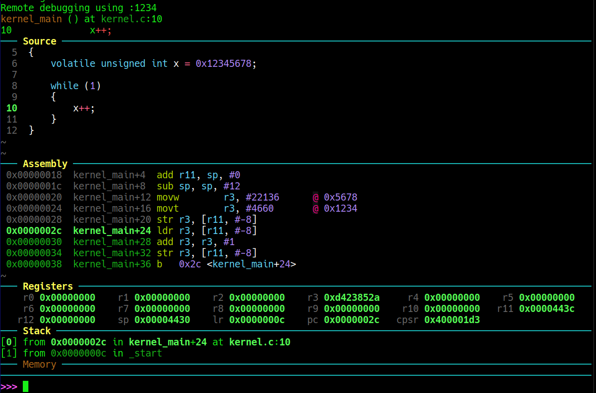
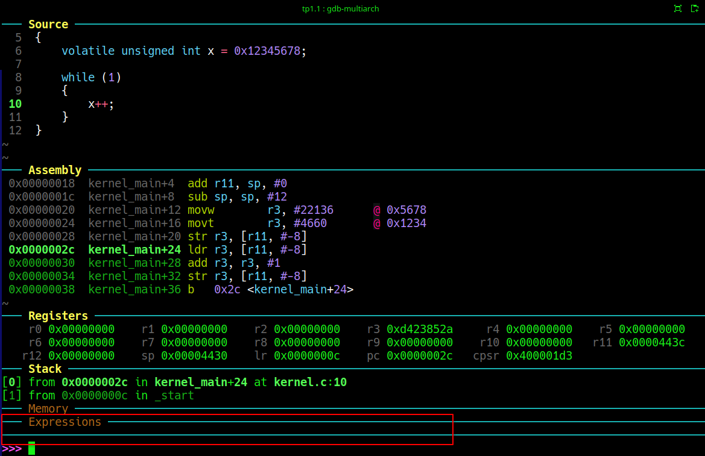
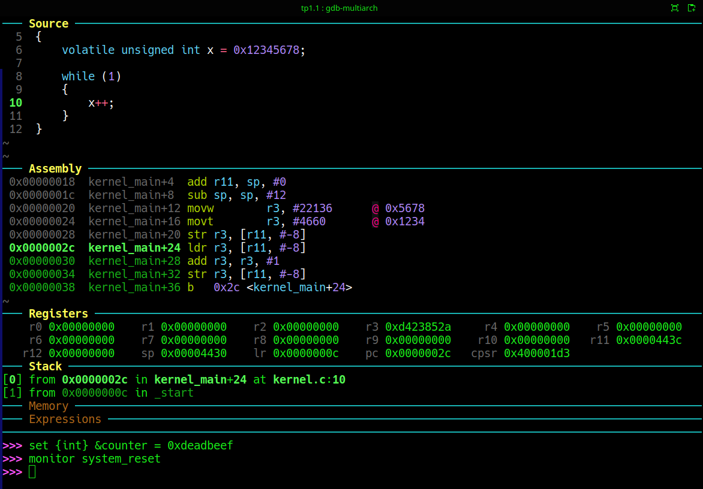
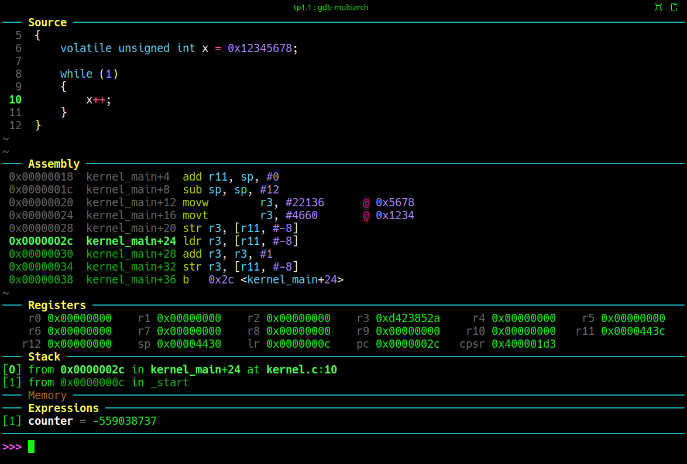
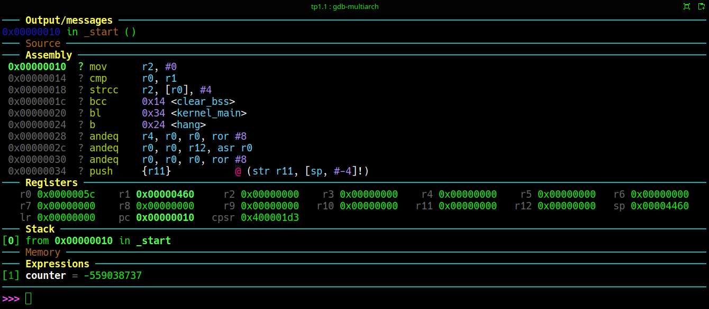

# Trabajo práctico N°1
## Primera Parte: Experimentando con .bss

Este trabajo propone entender que hace la sección ```.bss``` en un archivo **_elf_**, como trabajar de modo prolijo con ella, y agregar funcionalidades del linker script para definir símbolos que luego utilizarán correctamente los programas fuente.

En el linker script del tp0 se agregan dos etiquetas, en la sección ```.bss```.

```ld
 /* Inicio de .bss */
 /*   _bss_start = .;*/
    .bss :
    {
        *(.bss*)
        *(COMMON)
    } > RAM
    /* Fin de .bss */
/*    _bss_end = .;*/
```
En principio ambas líneas están comentadas para ver el efecto que queremos demostrar.
Estas etiquetas exportarán hacia los programas fuente el inicio y el fnal de la sección ```.bss```. 
```.bss``` es la sección donde van las variables globales sin inicializar:

Ejecutar en una terminal 
```bash
make debug
```
de modo de iniciar qemu.
Como siempre en otra terminal abrimos el debuger
```bash
gdb-multiarch kernel.elf
```
Una vez dentro de ```gdb ```, tipeamos el comando que conecta su entrada con la salida de ```qemu```. 
```gdb
target remote :1234
```

Fig.1. Vista de Dashboard. El cursor apunta a la primer línea (Dirección **0x00000000**)

Continuando con estos comandos una vez presentada la pantalla de dashboard:
```gdb
dashboard expressions
```
Con este comando se suma a la interfaz una ventana para evaluar expresiones (etiquetas, variables, etc. dentro de Dashboard). EL resultado se muestra en la Fig. 2.


Fig.2. Recuadrado en rojo el resultado del comando ```dashboard expressions```)

En este punto se requiere una intervención manual para dare un sentido realista al experiemento. ```qemu``` es un emulador. Se comporta como el hardware. Pero al ser un emulador, no termina siempre siendo 100% apegado al comportamiento del hardware. Cuando se enciende el equipo la memoria RAM se inicializa con valores random dependiendo de como se acomodan las cargas ellectricas al conectarse la tensión de alimentación. ```qemu``` al solicitar memoria la presenta inicialiada con ```0x00```. Por lo tanto, para intentar que este experimento se realista se ejecuta a continuación los siguientes dos comandos 

```gdb
set {int} &counter = 0xdeadbeef
monitor system_reset
```
El primero de los comandos escribe basura en la variable global para evitar que qemu pida ya memoria inicializada en ceros y no se vea el efecto de nuestro experimento.
El segundo comando reinicia qemu.

Como muestra la Fig. 3, ambos comandos no generan cambios visibles a nivel de interfaz


Fig.3. Ejecutados los comandos ```set {int} &counter = 0xdeadbeef``` y ```monitor system_reset``` nada ha cambiado en apariencia

Para ver el efecto, ahora vamos a visualidar la variable counter. Para ello hay que activar el watch de esta expresión en Dasboard:
```gdb
dashboard expressions watch counter
```
Puede verse un valor arbitrario que coincide con el ```set``` de la variable, en el screen shot de la Fig.4.


Fig.4. El valor presentado por la expresión está en decimal y corresponde a ```set {int} &counter = 0xdeadbeef```, ya que por defecto se trabaja con números signados.

>[:heavy_check_mark: : **<span style="color:green">Concepto Importante</span>**]
> *Esta primer parte del experimento, es para poder simular el comportamiento de hardware Real. En un sistema de hardware la Memoria RAM no inicia en 0. Toma valores aleatorios

La siguiente parte de este trivial experimento pretende sentar un concepto menos trivial aún. Si en nuestro código C, definimos variables no inicializadas, por ejemplo:
```c
int counter;
char buffer[1024];
```
Ni el compilador ni el linker guardan esos ceros en la imagen binaria del código que generan. Es decir, en nuestro ```kernel.bin``` no existirá un bloque lleno de ```00 00 00 ...```, en el espacio que se reserva para esas variables. De hecho podemos comprobarlo listando el directorio en el que están estos fuentes para ver que éste archivo mide 92 bytes nada mas.


Es decir solo queda registrado en el encabezado elf del archivo ```kernel.elf``` información para hacer el espacio en memoria en el momento en que se cargue el programa para su ejecución (algo así como “reservame este espacio en RAM”).

Entonces aparece una obligación del código de boot.  Cuando la CPU arranca y antes de entrar a kernel_main(), esa memoria contiene cualquier valor. **Entonces éste código de arranque debe poner en cero toda la sección ```.bss```**.

>[:heavy_check_mark: : **<span style="color:green">Concepto Importante</span>**]
> *El runtime no aparece mágicamente. En un programa de aplicación cualquiera, alguien ya hizo esto por nosotros. Puede haber sido Linux, libc, o cualquier otro recurso que tengamos instalado y nos ayude a construir nuestro código de aplicación. 
> Pero al trabajar bare metal, es runtime es ni mas ni menos que ¡**nuestro código**!. Por lo tantonos corresponde **dentro de nuestro código**:
>* inicializar stack
>* limpiar .bss
>* (luego copiar .data)
> entre varias cosas mas como veremos al avanzar en esta secuencia de experimentos

Lo que aportan las etiquetas ```_bss_start``` y ```_bss_end```, es información para que el linker sepa dónde quedó la sección ```.bss```. Entonces el linker proveerá éstos dos símbolos para que nuestro código haga algo del estilo:

```c
for (addr = _bss_start; addr < _bss_end; addr++)
    *addr = 0;
```
>:bulb: La idea a transmitir es:
>Una variable global sin inicializar debe comenzar en cero, pero nadie lo hace automáticamente en bare metal. El boot code debe recorrer la sección ```.bss``` y limpiarla antes de ejecutar el kernel.

Ese es el verdadero objetivo del TP1. El loop assembler o en C es solo la implementación.

Vamos a escribirlo en Assembler para ver algunas cosas relacionadas con la arquitectura ARMv7. 

En el archivo ```start.S``` agregamos el siguiente código luego de inicializar el stack y antes de invocar al kernel escrito en C.

```armasm
    /* Punteros a inicio y fin de .bss*/
    ldr r0, =_bss_start
    ldr r1, =_bss_end
    mov r2, #0
    /* SIEMPRE el boot pone a cero las variables no inicializadas */
clear_bss:
    cmp r0, r1
    strlo r2, [r0], #4 /*Ejecución condicional. Ver README.md*/
    blo clear_bss
```
El primer bloque de código inicializa los punteros tomando las etiquets definidas en el linker script, ```linker.ld```. Es muy interesante como esta prestación de linker puede 
definir etiquetas que luego se pueden referenciar desde cualquier parte del proyecto. 

En GNU Assembler (```GAS```), toda etiqueta que aparece en el código pero no está definida en el mismo archivo es tratada automáticamente como un símbolo externo.  Por lo tanto, la directiva ```.extern``` es ignorada. Fue incorporada por compatibilidad, con los viejos ensambladores como MASM en los que si es obligatorio su uso. La documentación oficial lo dice explícitamente:
>**```.extern```** is accepted in the source program — for compatibility with other assemblers — but it is ignored. **```GAS```** treats all undefined symbols as external.

Lo que ocurre con este toolchain es que el ensamblador genera una entrada en la tabla de símbolos del archivo objeto de salida (el ".o") con un tipo de dato ```UND``` (por undefined). Se puede verificar ejecutando:
```bash
arm-none-eabi-nm start.o
```
que genera en este caso la siguiente salida
```bash
         U _bss_end
         U _bss_start
00000014 t clear_bss
00000024 t hang
         U kernel_main
         U _stack_top
00000000 T _start
```
Observen que el tipo de dato ```U``` se escribe no solo para las etiquetas no definidas en el archivo assembler sino que también se aplica a ```kernel_main``` la cual ha sido declarada con ```.extern```. 
El linker (ld) es quien resuelve esa referencia al momento de enlazar todos los objetos.

>[:heavy_check_mark: : **<span style="color:green">Concepto Importante</span>**]
>El linker script solo entra en juego para decidir dónde se ubica cada sección en memoria, no para resolver símbolos entre objetos. La resolución de símbolos es responsabilidad del linker independientemente del script.

Si ejecutamos el código en dashboard hasta la dirección **```0x00000010```**, podemos observar como se inicializan los dos registros que se utilizarán como punteros al principio y al final de la sección ```.bss```. Es evidente de acuerdo con los valores de los registros **```r0```** y **```r1```** que las etiquetas se cargaron adecuadamente.


Fig.5.Ejecución del boot hasta luego de haber inicializado **```r0```** y **```r1```** con los valores de las etiquetas  ```_bss_start``` y  ```_bss_stop``` definidas en el linker script.

## Ejecución condicional

En arquitecturas ARM anteriores a AR;v7 (como la de los procesadores ARM7 o ARM9), la ejecución condicional fue introducida como una excelente herramienta de predicción general de saltos, ya que evitaba los bloque clásicos:

```asm
cmp
branch
```
Estas estructuras de programa generan el flush del pipeline, ya que generan una disrupción del orden secuencial natural de ejecución de instrucciones. La demora consecunte en volver a completar las diferentes etapas del pipeline, se conoce como penalidad de salto (o branch penalty)

Para estas generaciones de procesadores podíamos usar el bloque de assembly de nuestro fuente:
```armasm
    strlo r2, [r0], #4 
    blo clear_bss
```
y era claramente una solución muy simple y eficiente.

En Cortex-A, la situación es diferente. Por ejemplo en el caso del Cortex-A9 que estamos trabajando en nuestra Zynq7000, tenemos una CPU muy avanzada respecto de las generaciones anteriores. Implementa _Out of Order Excecution (**OoO**)_ que, aunque no es una versión muy sofisticada, le permite realizar Ejecución Especulativa, Tiene un pipeline mas profundo que el de tres etapas que a esta altura es antidiluviano, y sobre todo posee un sistema de _Branch Prediction_.
Por lo tanto un branch del tipo:
```armasm
cmp r0, r1
bhs done
``` 
cuesta casi cero si se predice correctamente el salto. En cambio, si utilizáramos una instrucción de ejecución condicional todavía debería decodificarse, entrar al pipeline, evaluarse, y eventualalmente anularse ("nullified"). Y esto también tiene costo.

¿Cual es la regla práctica para estos procesadores mas nuevos como el Cortex-A9?
No está mal usar conditional execution para
secuencias de 1–2 instruccionescomo las que estamos usando para inicializar ```.bss```. Es razonable. Pero ya no conviene abusarla para bloques mas largos, del tipo 

```armasm 
addne ...
strne ...
movne ...
ldrne ...
```
En estas nuevas versiones de CPU ya comienza a limitar la optimización del pipeline.

En este TP, la vamos a emplear es un ejemplo de un ARM clásico, introducimos el tema de predicción, que es un concepto importante, y con solo una instrucción
queda muy compacto

Pero merece una aclaración muy importante:

Aunque ARM permite ejecución condicional, en microarquitecturas mas modernas como Cortex-A9 no siempre mejora rendimiento. Aquí se usa por claridad y para introducir el mecanismo, no porque necesariamente sea más rápido. Esto además conecta con por qué ARMv8-A / AArch64, que definen procesadores aun mas avanzados que un Cortex-A9 abandonó casi toda la predicación general (no tiene instrucciones de ejecución condicional).

## Ejecutar el resto del programa

Esto permitirá ver como se inicializa la sección ```.bss``` , y como quedan las variables no inicializadas, además de verificar el acceso correcto a la función ```kernel_main``` escrita en el archivo ```kernel.c```. 


