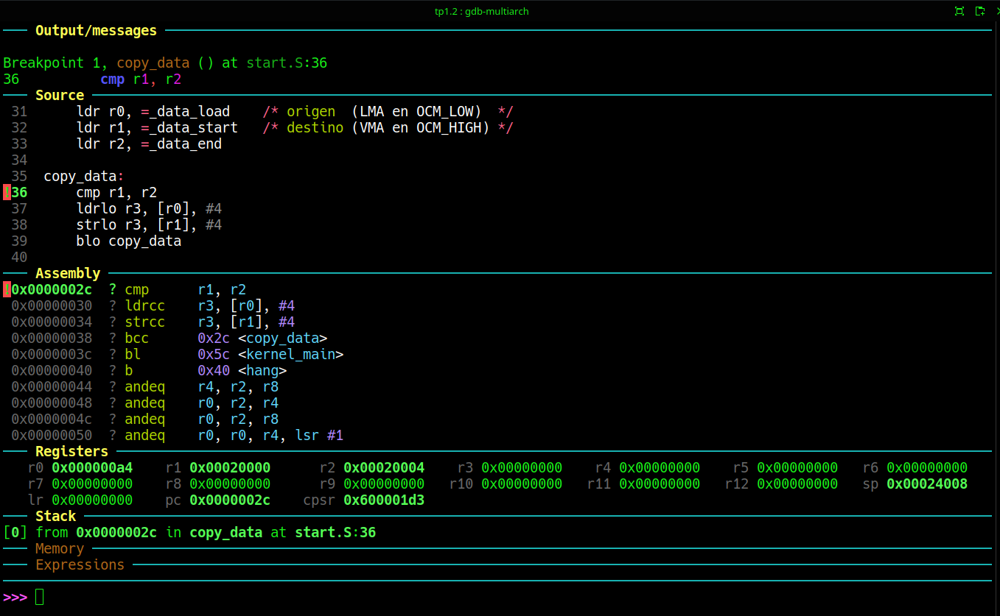

# Trabajo práctico N°1
## Segunda Parte: Reubicando ```.data```

### Ojetivo
Este simple TP es para introducir al anterior la reubicación en memoria física de la sección de datos inicializados. 

### Introducción 
Por lo general la imagen binaria de un sistema es una imagen compacta con las secciones de código y datos ubicadas una a continuación de la otra. Los offsets relativos de las inatrucciones se calculan en tiempo de compilación de acuerdo con estas ubicaciones. Sin embargo en algunos casos se terminan ubicando en áreas de memoria no contiguas, y por lo tanto las direcciones definitivas en las que se cargaráon las secciones difieren de las direcciones que ocupan en la imagen binaria que generan el compilador y e linker durante el build.
En la sintaxis empleada por el Linker en sus scripts, éstas direcciones se llaman **Loadable Memory Address (LMA)**, y **Virtual Memory Address (VMA)** respectivamente.

Cada sección de un ejecutable tiene en realidad dos direcciones. 
* **VMA** (por Virtual Memory Address): es la dirección que el código asume en tiempo de ejecución. Es lo que el compilador grabó en cada instrucción, en cada referencia a una variable global, en cada puntero de función. 
* **LMA** (Load Memory Address) es la dirección donde esa sección reside físicamente en la imagen binaria, típicamente en Flash o ROM. Para secciones de solo lectura como ```.text``` y ```.rodata```, ambas direcciones coinciden. El código se ejecuta directamente desde donde fue grabado. Para ```.data``` en cambio, la situación es diferente: los valores iniciales tienen que estar almacenados en algún lugar no volátil (**LMA** en una Flash), pero las variables en sí necesitan vivir en la RAM para poder modificarse (**VMA** en SRAM). 

El linker es quien registra ambas direcciones; el programador es quien escribe el código de startup que hace la copia. En el caso particular de nuestro proyecto en la Zynq 7000, a esta altura la dirección definitiva que debe ocupar ````.data```` en memoria, es decir la **VMA**, podría perfectamente coincidir con la dirección de la sección ```.data``` en la imagen binaria producto del build, es decir, **LMA**.
La memoria en el startup de un sistema contiene calquier valor de modo que para, asumir los valores iniciales el código de boot *debe* copiar la sección ```.data``` para garantizar esos valores.
Por eso en el linker script de ésta versión del TP definiremos vamos a hacer varios cambios.
* redefinimos la memoria asumiendo el uso de por ahora la RAM OCM unicamente.
```ld
MEMORY
{
    OCM_LOW  (rx)  : ORIGIN = 0x00000000, LENGTH = 128K
    OCM_HIGH (rwx) : ORIGIN = 0x00020000, LENGTH = 128K
}
```

* En cada sección de las restantes reemplazamos **RAM** por **OCM_LOW** (```.text``` y ```.rodata``` ya que no son modificables), o por **OCM_HIGH** para el resto

* Definiremos la sección ```.data``` de la siguiente manera:
```ld
    _data_load = .;          /* LMA de .data: justo después de .rodata en OCM_LOW */

 .data :
    {
        _data_start = .;
        *(.data*)
        _data_end = .;
    } > OCM_HIGH AT> OCM_LOW
```   

Usamos la directiva **```AT> OCM_LOW```** en lugar de **```AT(expr)```**, ya que delega en el linker el cálculo del **LMA**. Es como indicarle _"ponés la **VMA** en **OCM_HIGH**, pero seguís consumiendo espacio en **OCM_LOW** justo donde terminó la sección anterior"_. 

* Definiremos una sección ```.stack``` con miras a los próximos TPs de la siguiente manera:
```ld

    .stack (NOLOAD) :
    {
        . = ALIGN(8);
        . += 0x4000;
        _stack_top = .;
    } > OCM_HIGH

```
>:warning: **Advertencia** 
>A diferencia de **```.bss```**, la sección **```.data```** sí ocupa espacio en el binario, razón por la cual necesitamos copiarla. Aqui estamos emulando, pero en Hardware real ambas operaciones son obligatorias.

### Implementación de la copia
La copia podría hacerse tanto en ```kernel.c``` como en ```start.S```. Nuevamente recurrimos al assembler para familiarizarte con las instrucciones de la arquietctura ARMv7.El siguiente bloque (abusando tal vez de la ejecución condicional) implementa la copia

```armasm
/*----------------------------------*/
/* copiar .data desde LMA a VMA     */
/*----------------------------------*/

    ldr r0, =_data_load    /* origen  (LMA en OCM_LOW)  */
    ldr r1, =_data_start   /* destino (VMA en OCM_HIGH) */
    ldr r2, =_data_end

copy_data:
    cmp r1, r2
    ldrlo r3, [r0], #4
    strlo r3, [r1], #4
    blo copy_data
```
### Como queda el Mapa de Mmoria


Fig.1. Mapa de memoria. Observar las áreas de **VMA** y **LMA**.


### Experimentación
Se construye y se debuguea como lso tp anteriores. Se inicia la ejecución y se coloca un Breakpoint en el label ```copy_data```, mediante 
```gdb
b copy_data
```
Como resultado se llega a la función de copia de la sección ```.data```, con los dos punteros inicializados. El siguiente screenshot es lo que deberías ver:


Fig.2. Punteros a origen y destino de ```.data```, **```r0```=LMA** y **```r1```=VMA** 

>:mag: Observaciones
>El Linker permite explotar una imagen compacta de un archivo binario producto de un build ubicando diferentes secciones en diferentes partes de la memoria con diferentes atributos.
>Piensen lo siguiente. Si no tuviésemos esta facilidad la imagen binaria del archivo a cargar en la flash debería tener mas de 128Kbytes en este caso para contener un programa muy pequeño con minimos datos.
>¿Y si necesitaríamos un minimo código en el fondo de la memoria? Digamos en 0xC0000000.
>Un binario de 3Gigas???
>God save the linker!