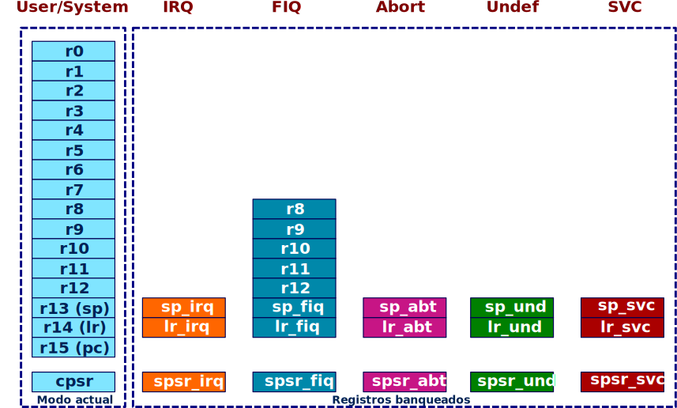
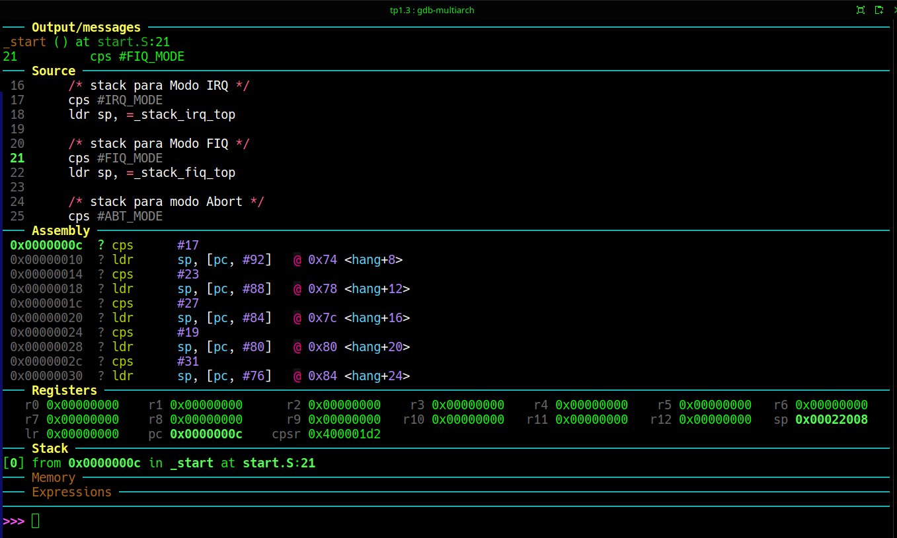
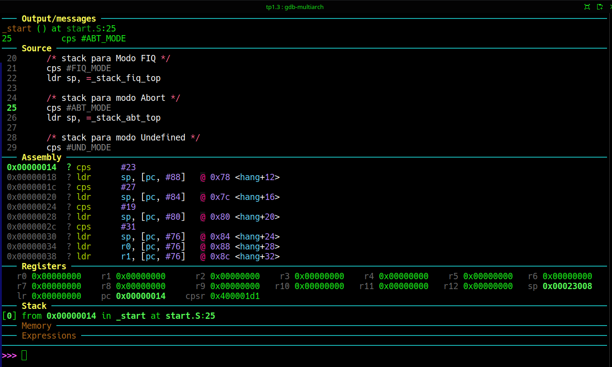
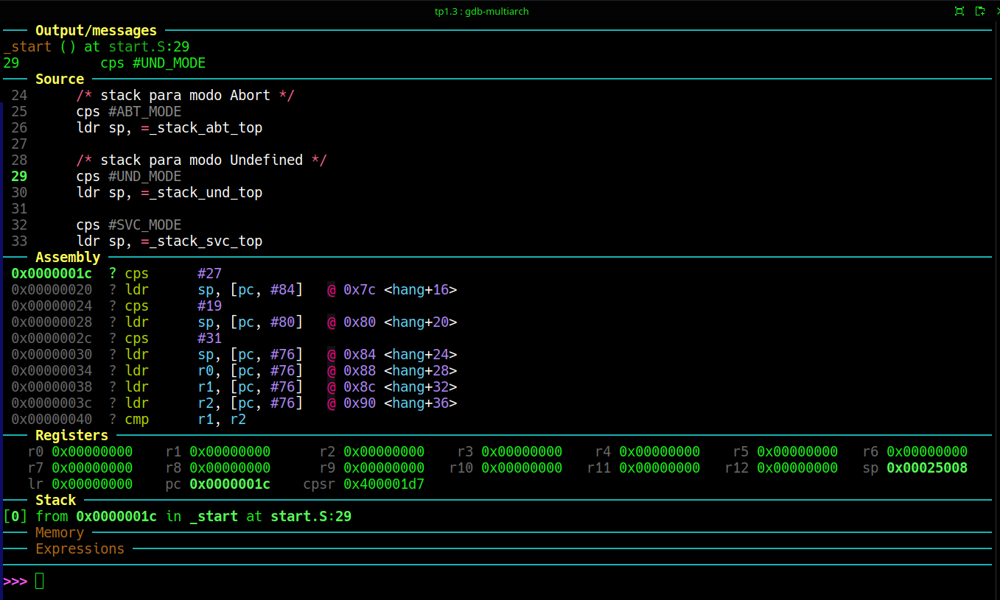
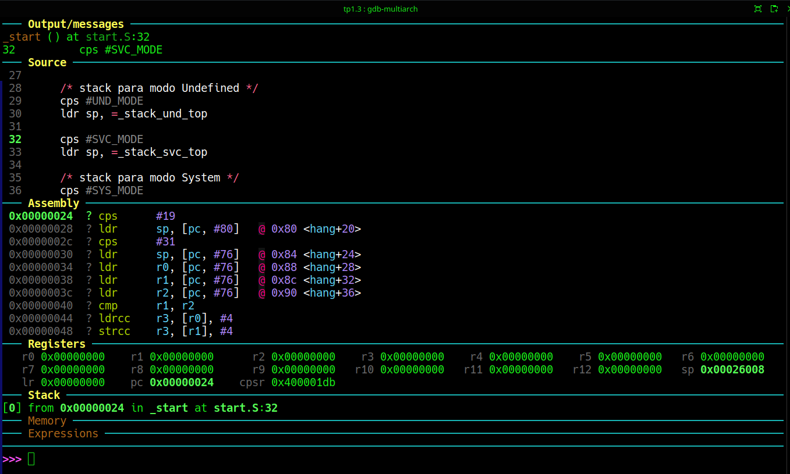
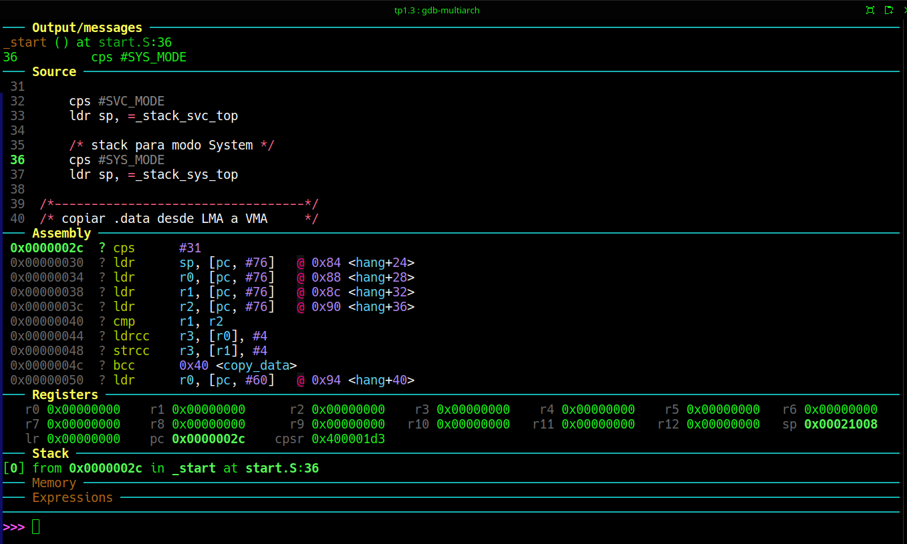
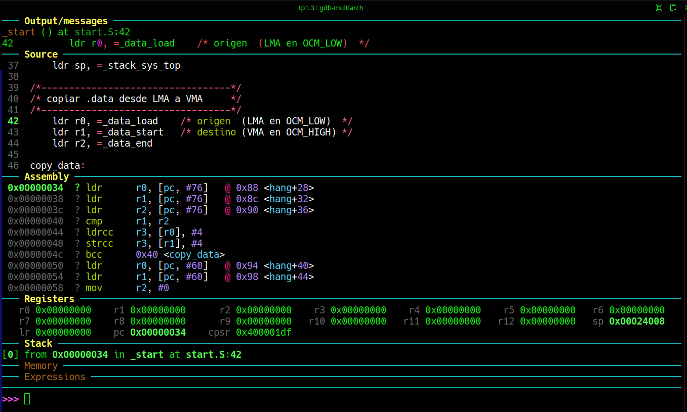

# Trabajo práctico N°1
## Tercera Parte: Inicialización de un stack por cada Modo.

### Objetivo
Vamos a resolver algo que tiene que ver con una idea central de el soporte de Hardware a un Sistema Operativo:
> _El modo privilegiado tiene su propio stack_. 

### Introdución
El Cortex-A9, como cualquier procesador ARMv7 pasa a un modo de operación diferente por cada fuente de Interrupción / Excepción. Todos son modos privilegiados, y por lo tanto cada uno debe tener un stack diferente. Por otra parte el modo System, si bien no responde a ninguna Interrucpión / Excepción tambien es un modo privilegiado, y del mismo modo debe tener su propio stack. La siguiente Figura muestra los registros que se banquean para los modos Privilegiados y deja ver la diferencia conceptual del Modo System.

En suma cada stack banqueado se suele nombrar con un sufijo dado por una abreviatura del modo para poder diferenciarlos
```armasm
SP_svc
SP_irq
SP_fiq
SP_abt 
SP_und
```
El Modo System no banquea registros usa los mismos el modo User que es el modo No privilegiado de ejecución.


Fig.1. Registros banqueados de un procesador ARMv7. Por ahora nos concentramos en los diferentes registros de stack.

#### Problemas de stacks y contextos.

Los Modos User y System comparten los mismos registros, aun teniendo diferentes privilegios (Uno es User y el otro kernel)

> :bulb: el mismo registro físico **```SP```** puede apuntar a distintos espacios protegidos según el modo y según los atributos de cada región de memoria establecidos por la MMU (Aún no hemos llegado a ese punto. Ya lo haremos)
>Esto quiere decir que el aislamiento entre las zonas de memoria no se establece por el hecho de tener registros distintos, sino mediante los siguientes tres recursos:
> * **MMU**
> * **permisos de página**
> * **bit de privilegio del CPU**

User y System son mas que dos niveles de privilegio, el mismo contexto de registros, solo que USR → no privilegiado, y SYS → privilegiado

>:mag: **Observaciones**:
> SYS puede leer/escribir el stack del proceso usuario porque comparten el mismo registro **```SP```**. **Esto es deliberado**. ARM parece haber pensado el Modo System mode justamente para permitir, al kernel ejecutarse con los mismos registros del proceso actual, sin tener que copiar contexto. Esto resulta muy útil para:
> * syscall handling
> * IRQ nested
> * scheduling
>
>User y System comparten el mismo stack pointer porque representan el mismo hilo de ejecución; lo único que cambia es el nivel de privilegio con que ese hilo se ejecuta.
>USR mode  = aplicación corriendo
>SYS mode  = ese mismo contexto, pero con privilegios de kernel
>No utilizan dos stacks distintos porque **no son dos contextos distintos**.
---
En cambio los modos de excepción / Interrupción:
* ```SVC```
* ```IRQ```
* ```FIQ```
* ```ABT```
* ```UND```
se benefician de trabajar en un stack separado (igual que System) pero con un registro ```SP``` también separado (o banqueado), ya que son en esencia una discontinuidad en el flujo normal de ejecución. 
---

> **Conclusiones** 
>* Tener un stack distinto por privilegio no es obligatorio.
> Lo importante es separar **contextos**, no necesariamente registros.
>
> * En ARM, ```User``` y ```System``` son el mismo contexto de ejecución con distinto nivel de privilegio; por eso comparten ```SP```.
>
> * El aislamiento entre kernel y usuario lo garantiza la **MMU**, que hace que ese ```SP``` apunte a páginas distintas o con permisos distintos según quién esté ejecutando.
>
> * En cambio ```IRQ```, ```SVC``` y otros modos de excepción sí tienen stack propio porque representan contextos diferentes que pueden interrumpir al contexto actual.


## Implementación:

Para implementarlo, hay que escribir un poco. En el linker script la sección .stack debe ser escrita ahotra de esta forma:
```ld
    .stack (NOLOAD) :
    {
        . = ALIGN(8);
        . += 0x1000;
    _stack_svc_top = .;
    _stack_irq_top = _stack_svc_top + 0x1000;
    _stack_fiq_top = _stack_irq_top + 0x1000;
    _stack_sys_top = _stack_fiq_top + 0x1000;
    _stack_abt_top = _stack_sys_top + 0x1000;
    _stack_und_top = _stack_abt_top + 0x1000;
    } > OCM_HIGH
```
Es decir, definimos 6 stacks, uno para cada modo, y uno a continuación del otro.

En el archivo ```start.S``` se agrega el siguiente código

```armasm
/*----------------------*/
    /* set stacks */
    /* stack para Modo IRQ */
    cps #IRQ_MODE
    ldr sp, =_stack_irq_top

    /* stack para Modo FIQ */
    cps #FIQ_MODE
    ldr sp, =_stack_fiq_top

    /* stack para modo Abort */
    cps #ABT_MODE
    ldr sp, =_stack_abt_top

    /* stack para modo Undefined */
    cps #UND_MODE
    ldr sp, =_stack_und_top

    cps #SVC_MODE
    ldr sp, =_stack_svc_top

    /* stack para modo System */
    cps #SYS_MODE
    ldr sp, =_stack_sys_top
```

Por otra parte es hora de comenzar a introducir prácticas de programación que empiecen a poner en orden los diferentes archivos de código. En el subdirectorio ```includes``` hemos creado un archivo armv7.inc en el que comenzaremso por definir literales para utilizar en el código en lugar de los valores numéricos. Esto aporta claridad.Esos literales los vemos en el código anterior, y están definidos del siguiente modo en el nuevo archivo ```armv7.inc```.

```armasm
/* Modos del procesador ARM */
.equ USR_MODE, 0x10
.equ FIQ_MODE, 0x11
.equ IRQ_MODE, 0x12
.equ SVC_MODE, 0x13
.equ ABT_MODE, 0x17
.equ UND_MODE, 0x1B
.equ SYS_MODE, 0x1F
```

### Ejecución
La operatoria es la misma de siempre. En ```start.S``` hemos colocado al inicio el código de inicialización de los stacks para ni bien se arranque el boot podamos ver el valor del Modo en los bits ```CPSR[5:0]```, y como varía el valor de ```sp``` cada vez que cambiamos de modo.



Fig.2. Luego de poner al procesador en Modo IRQ.
Empecemos a construir la tabla de valores a medida que avanzamos con gdb aalizando el código.
Se recomienda emplear el comando Step Into ```si``` para avanzar paso a paso y ver com ocambia cada registro involucrado.
```
┏━━━━━━━━━━┳━━━━━━━━━━━━━━━┳━━━━━━┳━━━━━━━━━━┓
┃   CPSR   ┃   Mode bits   ┃ Mode ┃    SP    ┃
┃          ┃  CPSR & 0x3F  ┃      ┃          ┃
┣━━━━━━━━━━╋━━━━━━━━━━━━━━━┳━━━━━━╋━━━━━━━━━━┫
┃0x400001D2┃ 010010 = 0x12 ┃ IRQ  ┃0x00022008┃
┗━━━━━━━━━━┻━━━━━━━━━━━━━━━┻━━━━━━┻━━━━━━━━━━┛
```

Fig.3. Luego de poner al procesador en Modo FIQ.
```
┏━━━━━━━━━━┳━━━━━━━━━━━━━━━┳━━━━━━┳━━━━━━━━━━┓
┃   CPSR   ┃   Mode bits   ┃ Mode ┃    SP    ┃
┃          ┃  CPSR & 0x3F  ┃      ┃          ┃
┣━━━━━━━━━━╋━━━━━━━━━━━━━━━┳━━━━━━╋━━━━━━━━━━┫
┃0x400001D2┃ 010010 = 0x12 ┃ IRQ  ┃0x00022008┃
┣━━━━━━━━━━╋━━━━━━━━━━━━━━━┳━━━━━━╋━━━━━━━━━━┫
┃0x400001D1┃ 010001 = 0x11 ┃ FIQ  ┃0x00023008┃
┗━━━━━━━━━━┻━━━━━━━━━━━━━━━┻━━━━━━┻━━━━━━━━━━┛
```

Fig.4. Luego de poner al procesador en Modo Abort.
```
┏━━━━━━━━━━┳━━━━━━━━━━━━━━━┳━━━━━━┳━━━━━━━━━━┓
┃   CPSR   ┃   Mode bits   ┃ Mode ┃    SP    ┃
┃          ┃  CPSR & 0x3F  ┃      ┃          ┃
┣━━━━━━━━━━╋━━━━━━━━━━━━━━━┳━━━━━━╋━━━━━━━━━━┫
┃0x400001D2┃ 010010 = 0x12 ┃ IRQ  ┃0x00022008┃
┣━━━━━━━━━━╋━━━━━━━━━━━━━━━┳━━━━━━╋━━━━━━━━━━┫
┃0x400001D1┃ 010001 = 0x11 ┃ FIQ  ┃0x00023008┃
┣━━━━━━━━━━╋━━━━━━━━━━━━━━━┳━━━━━━╋━━━━━━━━━━┫
┃0x400001D7┃ 010111 = 0x17 ┃ ABT  ┃0x00025008┃
┗━━━━━━━━━━┻━━━━━━━━━━━━━━━┻━━━━━━┻━━━━━━━━━━┛
```

Fig.5. Luego de poner al procesador en Modo Undef.
```
┏━━━━━━━━━━┳━━━━━━━━━━━━━━━┳━━━━━━┳━━━━━━━━━━┓
┃   CPSR   ┃   Mode bits   ┃ Mode ┃    SP    ┃
┃          ┃  CPSR & 0x3F  ┃      ┃          ┃
┣━━━━━━━━━━╋━━━━━━━━━━━━━━━┳━━━━━━╋━━━━━━━━━━┫
┃0x400001D2┃ 010010 = 0x12 ┃ IRQ  ┃0x00022008┃
┣━━━━━━━━━━╋━━━━━━━━━━━━━━━┳━━━━━━╋━━━━━━━━━━┫
┃0x400001D1┃ 010001 = 0x11 ┃ FIQ  ┃0x00023008┃
┣━━━━━━━━━━╋━━━━━━━━━━━━━━━┳━━━━━━╋━━━━━━━━━━┫
┃0x400001D7┃ 010111 = 0x17 ┃ ABT  ┃0x00025008┃
┣━━━━━━━━━━╋━━━━━━━━━━━━━━━┳━━━━━━╋━━━━━━━━━━┫
┃0x400001DB┃ 011011 = 0x1B ┃ UND  ┃0x00026008┃
┗━━━━━━━━━━┻━━━━━━━━━━━━━━━┻━━━━━━┻━━━━━━━━━━┛
```

Fig.6. Luego de poner al procesador en Modo SVC.
```
┏━━━━━━━━━━┳━━━━━━━━━━━━━━━┳━━━━━━┳━━━━━━━━━━┓
┃   CPSR   ┃   Mode bits   ┃ Mode ┃    SP    ┃
┃          ┃  CPSR & 0x3F  ┃      ┃          ┃
┣━━━━━━━━━━╋━━━━━━━━━━━━━━━┳━━━━━━╋━━━━━━━━━━┫
┃0x400001D2┃ 010010 = 0x12 ┃ IRQ  ┃0x00022008┃
┣━━━━━━━━━━╋━━━━━━━━━━━━━━━┳━━━━━━╋━━━━━━━━━━┫
┃0x400001D1┃ 010001 = 0x11 ┃ FIQ  ┃0x00023008┃
┣━━━━━━━━━━╋━━━━━━━━━━━━━━━┳━━━━━━╋━━━━━━━━━━┫
┃0x400001D7┃ 010111 = 0x17 ┃ ABT  ┃0x00025008┃
┣━━━━━━━━━━╋━━━━━━━━━━━━━━━┳━━━━━━╋━━━━━━━━━━┫
┃0x400001DB┃ 011011 = 0x1B ┃ UND  ┃0x00026008┃
┣━━━━━━━━━━╋━━━━━━━━━━━━━━━┳━━━━━━╋━━━━━━━━━━┫
┃0x400001D3┃ 010011 = 0x13 ┃ SVC  ┃0x00021008┃
┗━━━━━━━━━━┻━━━━━━━━━━━━━━━┻━━━━━━┻━━━━━━━━━━┛
```

Fig.7. Luego de poner al procesador en Modo System.
```
┏━━━━━━━━━━┳━━━━━━━━━━━━━━━┳━━━━━━┳━━━━━━━━━━┓
┃   CPSR   ┃   Mode bits   ┃ Mode ┃    SP    ┃
┃          ┃  CPSR & 0x3F  ┃      ┃          ┃
┣━━━━━━━━━━╋━━━━━━━━━━━━━━━┳━━━━━━╋━━━━━━━━━━┫
┃0x400001D2┃ 010010 = 0x12 ┃ IRQ  ┃0x00022008┃
┣━━━━━━━━━━╋━━━━━━━━━━━━━━━┳━━━━━━╋━━━━━━━━━━┫
┃0x400001D1┃ 010001 = 0x11 ┃ FIQ  ┃0x00023008┃
┣━━━━━━━━━━╋━━━━━━━━━━━━━━━┳━━━━━━╋━━━━━━━━━━┫
┃0x400001D7┃ 010111 = 0x17 ┃ ABT  ┃0x00025008┃
┣━━━━━━━━━━╋━━━━━━━━━━━━━━━┳━━━━━━╋━━━━━━━━━━┫
┃0x400001DB┃ 011011 = 0x1B ┃ UND  ┃0x00026008┃
┣━━━━━━━━━━╋━━━━━━━━━━━━━━━┳━━━━━━╋━━━━━━━━━━┫
┃0x400001D3┃ 010011 = 0x13 ┃ SVC  ┃0x00021008┃
┣━━━━━━━━━━╋━━━━━━━━━━━━━━━┳━━━━━━╋━━━━━━━━━━┫
┃0x400001DF┃ 011111 = 0x1F ┃ SYS  ┃0x00024008┃
┗━━━━━━━━━━┻━━━━━━━━━━━━━━━┻━━━━━━┻━━━━━━━━━━┛
```
Esta Tabla es el resultado final de la inicialización de los stacks. Cada fila se escribió en el orden en que se inicializan en el código de ```start.S```.
Deliberadamente hemos inicializado los stacks en ```start.S```  en orden diferente, que que utilizamos en el linker script para ubicarlos en la sección ```.stacks```.
Por tal motivo la secuencia de inicialización qu epodemos además comprobar ejecutando paso a paso el código en ```gdb``` screenshots no muestra ```sp``` en orden creciente en la tabla.
El valor de las etiquetas se define en el linker script por lo tanto ese es el orden en el que se ponen los stacks dentro de la sección ```.stacks```. 
```start.S``` simplemente inicializa el registro de cada banco de acuerdo con el modo establecido en la instrucción previa y al valor definido por el linker script para cada etiqueta.