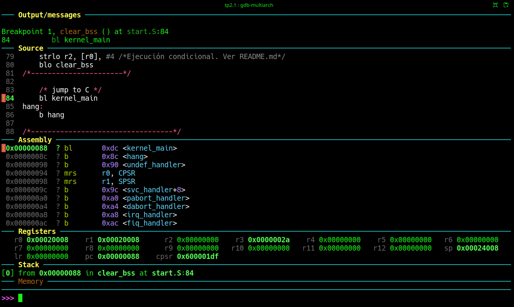
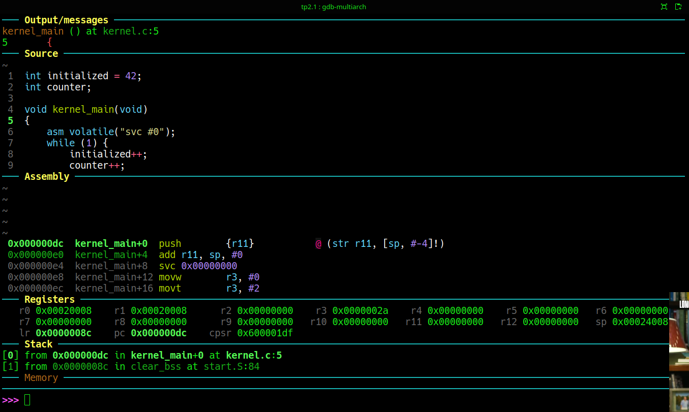
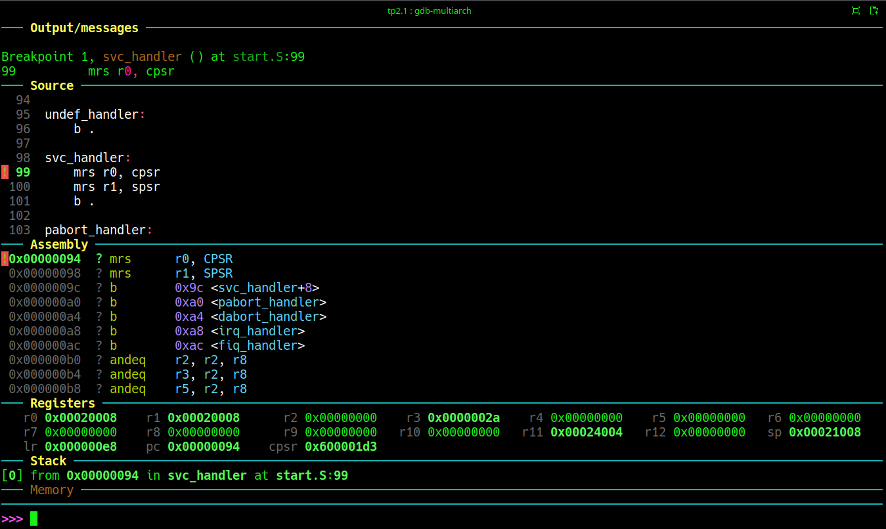
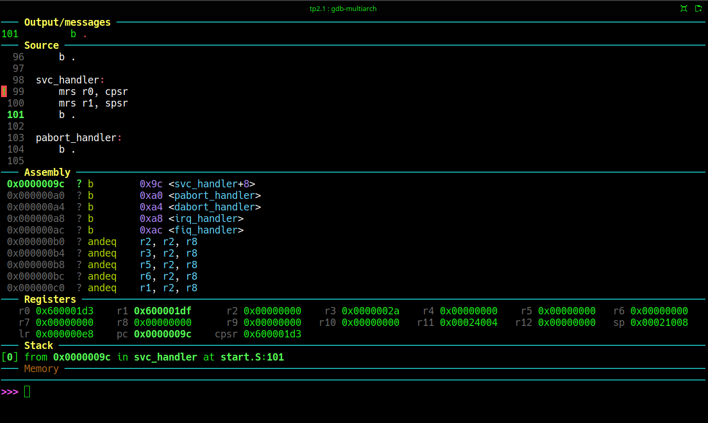

# Trabajo práctico N°2
## Primera Parte: Default Handlers. Prueba de SVC #0

### Objetivo
Partiendo de la tabla sin handlers aun del TP1.4, vamos a generar un cambio de modo a través de la Supervisor Call, para a traves de edta interrupción poner al procesador en modo SVC, y observar los registros involucrados

> **Concepto principal**:
> En ARM, al ocurrir una excepción, la CPU cambia de modo. Esto es: salta al vector correspondiente a la interrupción/excepción. En esa dirección solo hay lugar para una instrucción ya que 4 bytes mas abajo se encuentra el vector de la siguiente excepción (Excepto para FIQ que es la última.). Por lo tanto desde allí ejecuta un branch al handler. 

### :hammer_and_wrench: Construcción de la vector Table
En el archivo ```start.S``` ya tenemos una sección llamada ```.vectors```, definida para armar la tabla de vectores.
```armasm
/*----------------------------------*/
/* Vector table                     */
/*----------------------------------*/
.section .vectors, "ax"

_vectors:
    b _start              /* Reset */
    b .                   /* Undefined */
    b .                   /* SVC */
    b .                   /* Prefetch abort */
    b .                   /* Data abort */
    b .                   /* Reserved */
    b .                   /* IRQ */
    b .                   /* FIQ */
```

A partir de este punto habrá que colocarle los nombres de las fucniones a las que se invoca desde cada dirección del vector:
El código anterior debe quedar de la siguiente forma:

```armasm
/*----------------------------------*/
/* Vector table                     */
/*----------------------------------*/
.section .vectors, "ax"

_vectors:
    b _start
    b undef_handler
    b svc_handler
    b pabort_handler
    b dabort_handler
    b .
    b irq_handler
    b fiq_handler
```
Los nombres de las funciones pueden ser otros cualesquiera. Componerlo mediante dos palabras, una que significa el nombre de la excepción y ```_handler``` para significar el tipo de función, resultará bastante claro para quien lea este código por primera vez

Las funciones de los handlers se agregan en la sección ```.text``` y se escriben al final del archivo ```_start.S```. o en ```kernel.c```.

Por ahora las funciones seguirán implementando un loop infinito solo que en lugar de hacerlo directamente en el vector correspondiente, el vector invoca a la función del handler, en cuyo interior se ejecuta ahora el loop. 
Funcionamente nada cambia pero el programa mejora su estructura.

> :bulb: **Primer idea para experimentar**
> **probar SVC**.
> Desde el archivo kernel.c vammos a invocar a esta excepción, insertando una línea de assembler directo en un programa C.
> ```C
>    asm volatile("svc #0");
> ```
El inline assembler es muy útil cuando hay que hacer algo en un programa C que requiere forzosamente utilizar assembler. Permite no tener que construir un archivo específico para una simple instrucción de assembler.

### Ejecución
Se construye y ejecuta como los experimentos anteriores. Una vez en ```GDB```, para ver el comportamiento conviene colocar un breakpoint en la línea del archivo ```start.S``` justo antes de llamar a nuestro por el momento mínimo kernel ```kernel_main```: 
```gdb
b 84
continue
```
El programa se detiene en la línea indicada. Esto de paso sirve para mostrar como poner un brackpoint en una instrucción específica de un programa sin necesidad que tenga una etiqueta específica. 
Como resultado se obtiene una salida de Dashboard mostrada en el screenshot de la Figura 1.

Fig.1. Ejecución hasta el brakpoint de la línea 84 de ```start.S```. Es el estado antes de ejecutar **```bl  kernel_main```** 

En este punto exacto estamos a muy pocas instrucciones de cambiar de modo de ejecución. Por lo tanto es interesante mirar algunos registros del procesador. En particular son interesantes estos valores

```armasm 
cpsr = 0x600001df
sp   = 0x00024008
lr   = 0x00000000
pc   = 0x00000088
```
>:mag: **Observaciones**:
><span style="color:green">:heavy_check_mark:</span> Para empezar observamos que **```LR```** está en 0x00, lo cual indica que al momento no se había producido ninguna interrupción.
><span style="color:green">:heavy_check_mark:</span> El procesador está trabajando en Modo System ya que **```CPSR[5:0] & 0x1F = 0x1F```**
><span style="color:green">:heavy_check_mark:</span> **```sp```** tiene el valor correspondiente al stack definido como **```_stack_sys_top```** en el linker script. (Verificado en TP1.3.) 
><span style="color:green">:heavy_check_mark:</span> **```pc```** vale 0x00000088, que si observamos la ventana **```"Assembly"```** de dashboard corresponde a la instrucción **```bl```**. _Tener presente que de acuerdo con el manual en este punto el **```pc```**, está utilizándose para fetchear la segunda instrucción sucesora secuencial. 

Para un _Branch with Link_, necesitamos ejecutar en **```GDB```** el comando **```si```** (step Into) de modo que no la asuma como un comando único que involucra a toda la función invocada y la ejecute completa, sino que la tome como una instrucción simple y anide la ejecución de la función a la que se invoca.

La siguiente instrucción a ejecutar es:
```armasm
bl   kernel_main
```
El resultado es el salto a la función escrita en C, y el screenshot se muestra en la Figura 2.

Fig.2.  Estado justo luego de ejecutar **```bl  kernel_main```** 

En este punto puede observarse el valor de `los mismos 4 registros que referimos antes de ejecutar el salto.
```armasm 
cpsr = 0x600001df
sp   = 0x00024008
lr   = 0x0000008c
pc   = 0x000000dC
```
Como aun no se cambió de modo, los valores de **```CPSR[5:0]```** y **```SP```** siguen sin variar. Por su parte ```LR``` almacena la dirección en la que estaba fetcheando al momento de  retorno  del salto.

En este caso el salto es incondicional. Por lo tanto en la fase de decodificación del Pipeline ya se determina el salto: No se vuelve a sumar 4 al **```PC```**, que por lo tanto queda apuntando a la dirección de la instrucción siguiente del branch (sucesora secuencial), y esa dirección se almacena en el ```LR```.

En la Figura 2. podemos ver el código Assembly de la función kernel_main. A esta altura podemos prestar atención a las dos instrucciones que se insertan antes del Supervisor Call #0.
```armasm
    push    r11
    add     r11,sp,#4
```
Esto arma el stack frame de la función. Como no hay variables locales definidas ya que solo vamos a llamar a **```svc #0```**, queda solo en esto pero **```r11```** es utilizado como frame pointer.

Nuevamente avanzamos con comandos **```si```** incluyendo la ejecución de la llamada al modo Syupervisor. Esta nos llevará directo al handler de ```SVC```. 
Detenidos en la primer instrucción de este handler puodemos observar el valor de **```CPSR```**, y **```LR```**.
```armasm 
cpsr = 0x600001d3
lr   = 0x000000e8
pc   = 0x0000009C
```
La Figura 3. muestra el screenshot en este punto de la ejecución.

Fig.3. Estado ni bien se ingresa a ```SVC```.
En primer lugar debe comprobarse el cambio de valor en los bits **```CPSR[5:0]```**, consistente con el cambio a modo **SVC**.  
Comprobar en segundo lugar, la dirección de retorno al modo anterior en el registro **```LR```**. Tener presente que ahora el registro que muestra **```GDB```** corresponde a **```LR_svc```**. 
El tercer valor a corroborar es el de **```SPSR_svc```**,

>:mag: **Observaciones**:
><span style="color:green">:heavy_check_mark:</span>**```CPSR[5:0]```** = 0x13
><span style="color:green">:heavy_check_mark:</span>**```LR```** = **```LR_svc```** = Dirección de retorno (Instrucción posterior a SVC]. La razón es que la llamada se detecta en la fase de Decodificación del pipeline y por l otanto solo se suma 4 al **```PC```** una sola vez. Casuelmente **SVC** es una interrupción invocada por software y restorna justo a la instrucción correcta. No todas las interrupciones o excepciones se comportan igual y dependen de la etapa del pipeline en que se resuelvan y de su propio funcionamiento interno. Por razones de retrocompatibilidad con ARMv4 y 5, se asume un pipeline de 3 etapas, independientemente de cuantas etapas tenga en realidad un procesador mas moderno. Y se debe ajustar restando al **```LR```**, 4 en algunos casos, 8 en otros, o dejandolo tal cual en otros, antes utilizarlo para retornar. Esto se conoce como "fuga de abstracción" del pipeline en ARMv7. En uen romance.... **Horrible**: Enchastrar la arquitectura con dependencias de la organización rompe todos los libros conocidos.
><span style="color:red">:x:</span>```**SPSR_svc[5:0]**``` = Modo del procesador antes de invocar a la excepción. Desafortunadamente **```GDB```** no puede mostrar el valor de **```SPSR_svc```**, que es donde está almacenado el valor que tenía el registro **```CPSR```** en el modo desde donde se invocó a la excepción ```SVC```.

Para poder ver el valor del ```SPSR_svc```, hay que leerlo en un registro core de la arquitectura mediante una instrucción de lectura de Registros de sistema y de este modo poder visualizar el valor del registro de amera simple en ```GDB```.Esta operación se efectúa en nuestro experimento dentro del handler de **SVC**.

Para ello se requiere avanzar dentro del handler mediante el comando ```s``` o ```si```, dos veces mínimo para ejecutar un ciclo del loop infinito en donde se accede mediante los recursos de arquitectura de sistemas a los registros que no pueden ser vistos de primera mano:

El código que realiza esta tarea está en ```start.S```, que es el handler de **SVC**:
```armasm
svc_handler:
    mrs r0, cpsr
    mrs r1, spsr
    b .
```

Fig.4. Lectura de **```CPSR```** y **```SPSR```** del modo actual en **```r0```** y **```r1```**. 

Analizando el valor de r1 interesa fundamentalmete  
> **Conclusiones** 
> El hardware hace automáticamente tres cosas:
> * cambia de modo
> * guarda **```CPSR```** en **```SPSR```**
> * guarda dirección de retorno en **```LR```**
> * Luego salta al vector correspondiente.
> Terminamos de obsrevar la parte mas esencial de exceptiones ARM.

