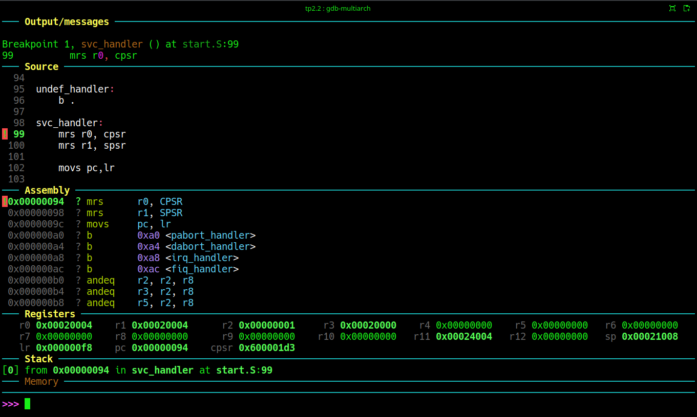
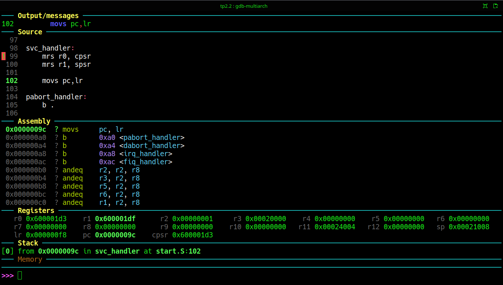
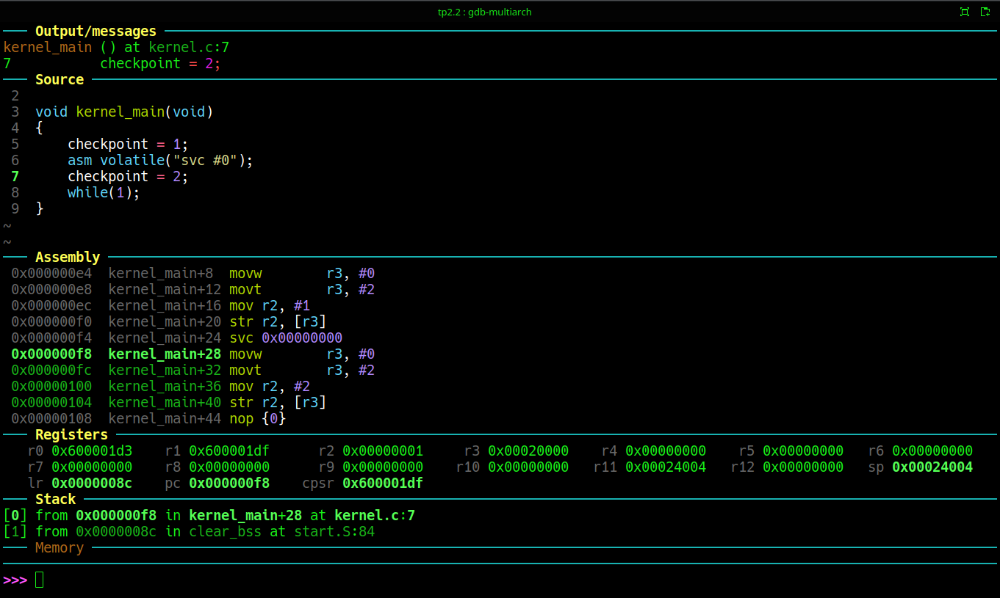

# Trabajo práctico N°2
## Segunda Parte: Default Handlers. Prueba de retorno de SVC #0

### Objetivo
Retornar de la interrupción SVC, al programa original. Analizar cambios de modo y observar los registros involucrados.

> **Flujo de ejecución que nos proponemos implementar**:
>```text
>kernel_main()
>   |
>   └──> svc #0
>             |
>             └──> svc_handler
>                       |
>                       └──> return
>   |
>   └──> instrucción siguiente a svc
>
> La idea al invocar una interrupción de software como **```SVC```** es que una vez que ésta resuelva el requerimiento del programa invocante, retorne a este para que pueda proseguir su ejecución. Nos proponemos implementar el mecanismo de retorno ya que al momento el handlder rudimentario que implementamos queda en un lazo infinito. 

### :hammer_and_wrench: Construcción de la vector Table
Recordemos que al invocar a **```SVC```**, el procesador automáticamente hace dos transferencias: **```PC → LR_svc```** y **```CPSR → SPSR_svc```**, luego de la cual hace **```CPSR[5:0] = 0x13```**, passando a modo **SVC**. Esto lo verificamos experiemntalmente del Trabajo Practico anterior. 
Por lo tanto el retorno debe revertir esta condición y tambien de la manera mas automaizada posible por parte del hardware: **```SPSR_svc → CPSR```** y saltar a la dirección que se resguardó oportunamente en **```LR_svc```**. ARM tiene instrucciones específicas para hacerlo.
Vamos a utilizar una de las mas simples:

```armasm
movs pc,lr
```
```
La "s" del final del nemónico, hace que no se comporte como un simple movimiento. Esta instrucción genera dos transferencias: **```CPSR ← SPSR_svc```**, la cual restituye el Modo al que tenía la CPU al momento de invocar a **SVC**, y **```PC ← LR_svc```**, que escribe el **```PC```**, lo cual es de hecho un branch

>:mag: **Observaciones**:
> Desde el punto de vista formal de Arquitectura del Procesadores, escribir en el **```PC```** es como mínimo desprolijo (una desprolijidad más, y van...).
> En general, modificar el contenido del **```PC```**, genera una discontinuidad en el flujo de ejecución. Esta situación tiene nombre: **branch**. Y se le reserva un tipo de instrucción específica, normalmente denominada .... **```branch```**!!!, o en x86 **```jump```**. Pero siempre se maneja con instrucciones específicas. Con la implementación de las unidades de predicción de saltos, la posibilidad de que cualquier instrucción modifique el **```PC```**, complica mucho e innecesaiamente el diseño de esta unidad que es hoy de facto un "must" en el diseño de un procesador.

Para probar el retorno limpiemos ```kernel.c``` dejando solo este código:

```C
void kernel_main(void)
{
    asm volatile("svc #0");
    while(1);
}
```

### Ejecución
Se construye y ejecuta como los experimentos anteriores. Una vez en ```GDB```, para ver el comportamiento conviene colocar un breakpoint en la línea del archivo ```start.S``` justo antes de llamar a nuestro por el momento mínimo kernel ```kernel_main```: 
```gdb
b svc_handler
continue
si 
si
```
Como resultado se obtienen las ventanas de Dashboard mostradas en los screenshots de las Figuras 1. y 2.

Fig.1. Ejecución hasta el brakpoint en la primer instrucción del handler de **SVC**.


Fig.2.  Estado justo antes de ejecutar el retorno del handler. 

En este punto estamos a punto de cambiar de modo de ejecución, en este caso, retornando al modo original antes de haber invocado a la interrucpción **SVC**. Nuevamente es interesante tomar nota del estado de algunos registros del procesador. 

```armasm 
cpsr = 0x600001d3
sp   = 0x00021008
lr   = 0x000000f8
pc   = 0x0000009C
```
La siguiente instrucción a ejecutar es:
```armasm
movs pc,lr  
```
El resultado es el screenshot se muestra en la Figura 3.


Fig.3.

En este punto revisemos el valor de `los mismos 4 registros que referimos antes de ejecutar el retorno.
```armasm 
cpsr = 0x600001df
sp   = 0x00024004
lr   = 0x0000008c
pc   = 0x000000f8
```
Se cambió de modo, los valores de **```CPSR[5:0]```** y **```SP```** siguen recuperaron los correspondientes al Modo System desde el cual se invocó a **SVC**. Por su parte ```LR``` no cambia.

